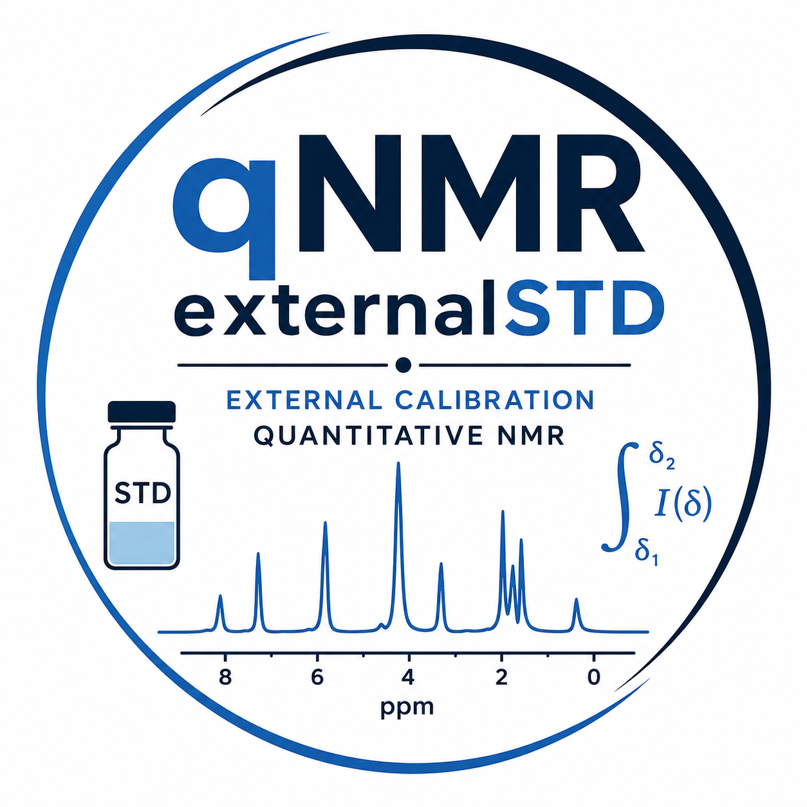

<p align="center">
  
</p>

# qNMR externalSTD

## Validation-Oriented qNMR and External Calibration Platform

`qNMR externalSTD` is a Streamlit-based platform for quantitative NMR (qNMR), external calibration workflows, spectral integration, line-shape fitting, and validation-oriented diagnostics.

The software was designed to prioritize:

- transparency
- reproducibility
- interpretability
- diagnostic traceability
- quantitative robustness

rather than fully automated “black-box” quantification.

The platform supports both:

- routine qNMR workflows
- complex metabolomics-like mixtures

including partially overlapped regions, asymmetric peaks, multiplets, and non-ideal experimental line shapes.

---

# Main Features

## Supported Data Types

- CSV spectra
- Bruker processed spectra (`pdata/1/1r`)
- raw Bruker FIDs
- single-spectrum workflows
- batch quantification workflows

---

# Integration Methods

The software includes both experimental and model-derived integration strategies.

| Method | Description |
|---|---|
| Sum Integration | Direct experimental point-sum integration |
| Raw Point Sum | Raw digital point accumulation |
| Trapezoidal | Numerical trapezoidal integration |
| Single Gaussian Fit | One Gaussian component |
| Single Lorentzian Fit | One Lorentzian component |
| Single pseudo-Voigt Fit | Mixed Gaussian/Lorentzian model |
| Multiplet pseudo-Voigt Fit | Multi-component constrained fitting |

---

# Scientific Philosophy

A central design principle of the platform is the distinction between:

- experimental integration
- model-derived integration
- fit diagnostics
- residual interpretation

The software intentionally exposes:

- fit quality
- residuals
- numerical consistency
- line-shape behavior
- model mismatch

instead of hiding them behind automated workflows.

---

# Important Experimental Observation

Systematic comparison between direct experimental integration and single-component line-shape fitting demonstrated that:

- Gaussian fitting systematically underestimates complex regions
- Lorentzian fitting recovers more area due to long tails
- pseudo-Voigt fitting produces intermediate behavior
- experimental Sum Integration consistently recovers the largest total area

This behavior strongly suggests that many complex qNMR regions cannot be accurately represented as a single idealized peak.

Typical complex regions may contain:

- unresolved overlap
- asymmetric tails
- multiplet structures
- partial coalescence
- baseline distortions
- experimental broadening

Therefore, the software recommends:

## Primary quantitative strategy

```text
Experimental Sum/Trapezoidal integration
````

## Diagnostic strategies

```text
Gaussian fitting
Lorentzian fitting
pseudo-Voigt fitting
multiplet fitting
```

These fitting approaches are primarily intended for:

* overlap assessment
* line-shape characterization
* fit diagnostics
* QC interpretation
* residual analysis

rather than direct replacement of experimental integration.

---

# Installation

## Clone repository

```bash
git clone <repository_url>
cd <repository_name>
```

---

## Create environment

```bash
conda create -n qnmr python=3.11
conda activate qnmr
```

---

## Install dependencies

```bash
pip install -r requirements.txt
```

---

## Run app

```bash
streamlit run app_pulcon.py
```

---

# Main Dependencies

* streamlit
* numpy
* pandas
* scipy
* plotly
* nmrglue

---

# Application Architecture

The application is divided into several workflow tabs.

| Tab               | Purpose                               |
| ----------------- | ------------------------------------- |
| Bruker Processing | Import and process Bruker experiments |
| Data              | Inspect spectra                       |
| Reference         | Configure external reference          |
| Sample            | Configure analyte/sample              |
| Integration       | Select integration/fitting methods    |
| Quantification    | Run concentration calculations        |
| Report            | Export results                        |

---

# Bruker Processing

The platform supports:

## Processed spectra

```text
pdata/1/1r
```

## Raw FID processing

Including:

* digital filter removal
* exponential multiplication
* zero filling
* Fourier transformation
* optional automatic phase correction

---

# Baseline Correction

Available baseline modes:

| Mode          | Description                         |
| ------------- | ----------------------------------- |
| None          | Raw experimental signal             |
| Linear        | Linear interpolation between limits |
| Local Minimum | Subtract local offset               |

For validation-oriented qNMR workflows, conservative baseline approaches are recommended.

---

# Mathematical Diagnostics

The platform exports several diagnostic metrics:

| Metric                     | Meaning                     |
| -------------------------- | --------------------------- |
| Fit/Sum ratio              | Fitted vs experimental area |
| Residual area              | Unexplained signal          |
| R²                         | Local fit agreement         |
| RMSE                       | Fitting error               |
| SNR                        | Local signal-to-noise       |
| FWHM                       | Linewidth estimation        |
| dx_ppm                     | Digital resolution          |
| Numerical/Analytical ratio | Mathematical consistency    |

---

# Fit/Sum Ratio Interpretation

| Ratio     | Interpretation                            |
| --------- | ----------------------------------------- |
| 0.95–1.05 | Excellent agreement                       |
| 0.80–0.95 | Acceptable                                |
| <0.80     | Model losing experimental area            |
| >1.10     | Possible overfitting or baseline artifact |

---

# Mathematical Validation

The software includes extensive internal validation for:

* ppm ↔ Hz conversion
* numerical integration
* pseudo-Voigt analytical area
* FWHM calculations
* Gaussian/Lorentzian parameter consistency
* amplitude vs area interpretation
* numerical discretization diagnostics

---

# Computational Workflow

Main processing stages include:

| Function Group        | Purpose                                  |
| --------------------- | ---------------------------------------- |
| Spectral import       | Bruker and CSV handling                  |
| Baseline correction   | Local integration correction             |
| Numerical integration | Experimental area calculation            |
| Line-shape fitting    | Gaussian/Lorentzian/pseudo-Voigt fitting |
| Diagnostics           | QC and residual analysis                 |
| Batch quantification  | Multi-sample workflows                   |
| Plotting              | Interactive visualization                |

---

# Recommended Workflow

## For validated qNMR

1. Inspect spectra manually
2. Start with:

   ```text
   Sum Integration
   ```
3. Compare with:

   ```text
   Trapezoidal
   ```
4. Use fitting methods as diagnostics
5. Inspect:

   * Fit/Sum ratio
   * residuals
   * linewidth
   * SNR
   * overlap behavior

---

# Intended Applications

The platform is suitable for:

* qNMR
* metabolomics
* natural products
* complex mixtures
* validation studies
* spectral QC
* line-shape analysis
* teaching and methodology development

---

# Current Philosophy

The software intentionally avoids aggressive fully automated deconvolution strategies.

Instead, the platform emphasizes:

* transparency
* validation
* user interpretation
* quantitative traceability
* model-awareness

This philosophy is particularly important for:

* metabolomics
* partially overlapped spectra
* inter-laboratory reproducibility
* quantitative validation workflows

---

# Future Directions

Potential future developments include:

* true multi-component fitting
* adaptive Voigt models
* ALS baseline correction
* rubber-band baseline
* probabilistic fitting
* uncertainty propagation
* automated QC scoring
* Bayesian spectral decomposition

---

# Citation

If you use this software in scientific work, please cite the associated publication (under preparation).

---

# License

License information to be added.

```
```
